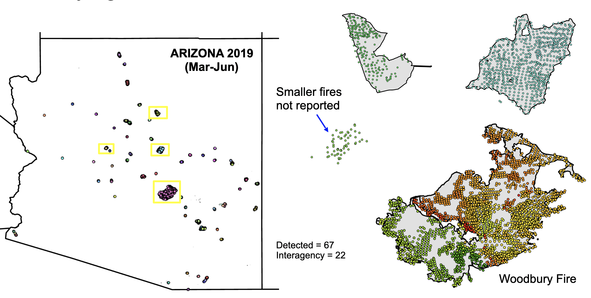
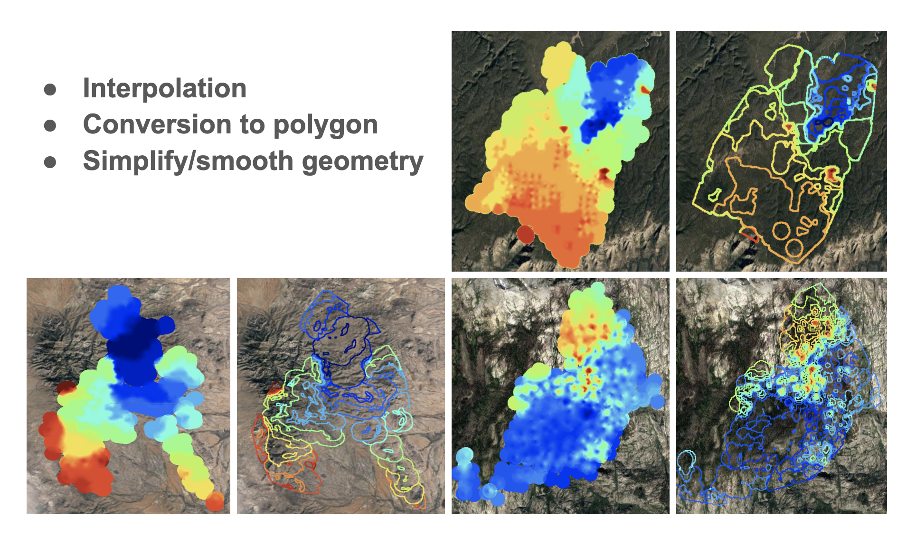
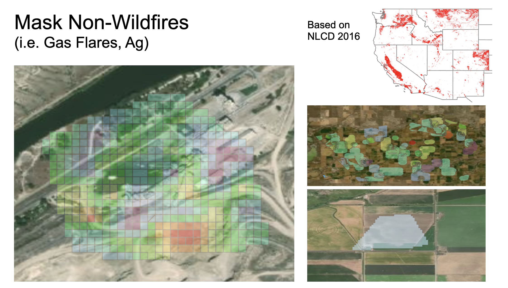
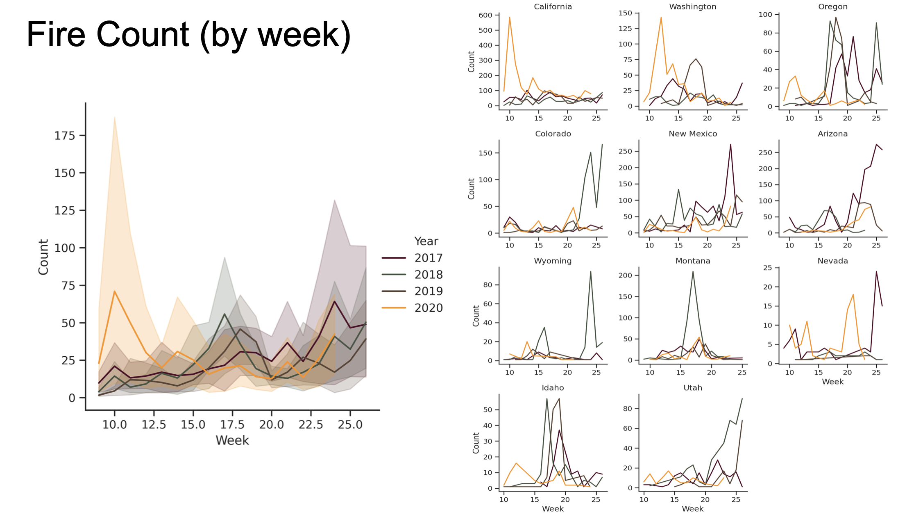
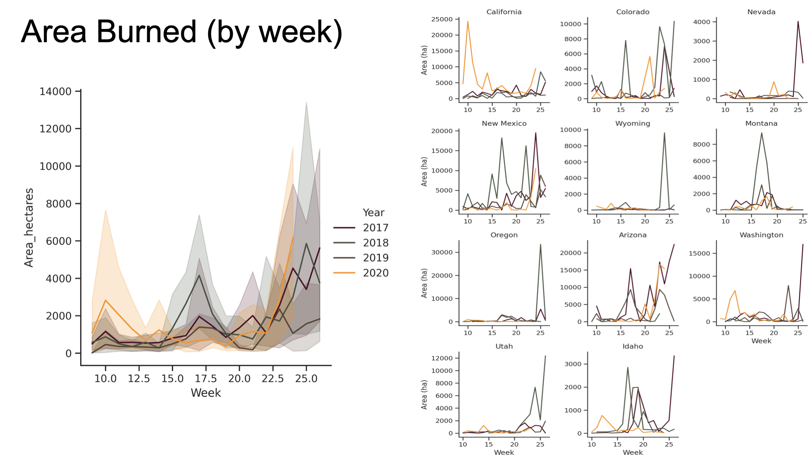

# Automating Fire Occurence Monitoring in the Western US

## Table of Contents  
[Project Description](#project-Description)  
1. [Identifying Fire Clusters](#1.-Identifying-Fire-Clusters)  
2. [Deriving Continuous Fire Perimeters](#2.-Deriving-Continuous-Fire-Perimeters)  
3. [Filtering Instances of Non-Wildland Fires ](#3.-Filtering-Instances-of-Non-Wildland-Fires)
4. [Fire Trends ](#4.-Fire-Trends)  

___

## Project Description 
Fire and land management agencies at local, state, and federal levels work to create and maintain fire datasets available nationwide. However, inconsistencies in the datasets i.e. frequency of documenting, quality of data layers, and methods used e.g. airborne, automatic mapping, digitizations are observed in most cases, oftentimes attributed to resource availabiity. In addition, even after consolidating the data layers, a high number of fires (e.g. small or low risk) within non-critical zones go unreported, or unmapped. These non-critical areas can be attributed to rural areas with lower populated areas and/or unprotected land management sites.  

To increase consistency in data quality and data availability, this project explores new automated methods in determining unique fire instances. Focusing on the Western United States from 2017 to 2020, we used the MODIS and VIIRS active fire products to identify discrete fire hotspots. 

The method then identifies fire clusters based on a recursive neighbor search based on temporal and spatial conditions. The resulting fire instance clusters were then used to derive continious daily fire perimeters using geostatistical interpolation metods to further quantify area burned. 

## 1. Identifying Fire Clusters

<figure class="image">
  
  <figcaption>Figure 1. Fire cluster instances for Arizona fires comparing interagency reported fires versus automated detection method. </figcaption>
</figure>

## 2. Deriving Continuous Fire Perimeters

<figure class="image">
  
  <figcaption>Figure 2. Continious fire perimeters were derived via interpolation method and was further smoothed during post-processing. </figcaption>
</figure>

## 3. Filtering Instances of Non-Wildland Fires 

Not all hotspots are wildfires. There are many fires and/or hotspot detections due to waste incineration, agriculture, etc. To differentiate land-use type, we used the 2016 National Land Cover Data layer to remote agricultural and highest density (metropolitan) areas. 

This fire type differentiation process was albeit a challenge and considered a simply a temporary fix until a more robust method is designed. 

<figure class="image">
  
  <figcaption>Figure 3. Examples of different types of fire from agricultural to industrial. </figcaption>
</figure>

## 4. Fire Trends 

Preliminary results quantifyng fire count and area burned from 2017 to 2020 at weekly intervals across states in the Western US. 

<figure class="image">
  
  <figcaption>Figure 4. Unique fire instances by week and state. </figcaption>
</figure>

<figure class="image">
  
  <figcaption>Figure 5. Total area burned by week and state. </figcaption>
</figure>